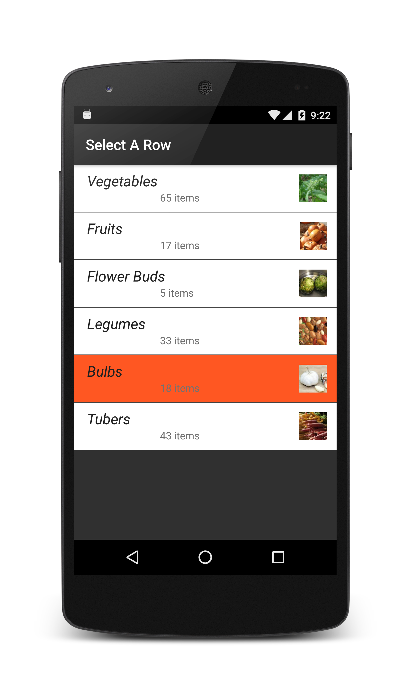

# Overview

This recipe will demonstrate one technique for programmatically selecting a row in a ListView when an Activity is first displayed. This example involves the use of a _state list drawable_ which will identify the drawable resource to be used for a given state of a row. This recipe will cover the following:

1. **Create a State List Drawable** &ndash; This is a special drawable that will set the appearance of a view as the view progresses through various states.
2. **Define a layout for the rows in the ListView** &ndash; This example will create a custom row layout that will be applied by an adapter. 
3. **Initialize the ListView** &ndash; Initialize the ListView with a custom adapter and set the `ChoiceMode` property.
4. **Programmatically Select the Initial Item** &ndash; Programmatically select a row when the Activity is displayed.

This is a screenshot of the sample application included with this recipe when it is first run and deployed to a device:



## Creating the State List Drawable Resource

To begin, create a _state list drawable_ name **Resources/drawable/list_item_selector.xml**. This drawable is an XML file that defines a drawable and when to apply it. This is a example of the state list selector for the sample project: 

```
<?xml version="1.0" encoding="utf-8"?>
<selector xmlns:android="http://schemas.android.com/apk/res/android">
  <item android:state_pressed="true">
    <shape>
      <gradient
        android:startColor="@color/row_pressed_start"
        android:endColor="@color/row_pressed_end"
        android:angle="270" />
    </shape>
  </item>
  <item android:state_activated="true" android:drawable="@color/row_selected" />
  <item android:drawable="@color/row_background" />
</selector>
```

The state list drawable defines the drawable that should be used by the view as it changes state. This particular example defines selectors for three different situations: 

* When a list row is pressed.
* When the user has selected a row. 
* The default drawable for all other states. 

The order of the items in the state list is important; Android will start at the top of the list, and apply the first selector that matches. 

## Create a Layout for the Rows

Next, create a custom layout for each row in the ListView, and set the value of the `android:background` property of the ViewGroup to `@drawable/list_item_selector` (which was created in the previous section). This is the contents of the file **Resources/layout/row_layout.axml** in the sample project: 

```
<?xml version="1.0" encoding="utf-8"?>
<RelativeLayout xmlns:android="http://schemas.android.com/apk/res/android"
    android:layout_width="fill_parent"
    android:layout_height="wrap_content"
    android:background="@drawable/list_item_selector"
    android:padding="8dp">
    <LinearLayout
        android:id="@+id/Text"
        android:orientation="vertical"
        android:layout_width="wrap_content"
        android:layout_height="wrap_content"
        android:paddingLeft="10dip">
        <TextView
            android:id="@+id/Text1"
            android:layout_width="wrap_content"
            android:layout_height="wrap_content"
            android:textColor="@color/row_text1"
            android:textSize="20dip"
            android:textStyle="italic" />
        <TextView
            android:id="@+id/Text2"
            android:layout_width="wrap_content"
            android:layout_height="wrap_content"
            android:textSize="14dip"
            android:textColor="@color/row_text2"
            android:paddingLeft="100dip" />
    </LinearLayout>
    <ImageView
        android:id="@+id/Image"
        android:layout_width="48dp"
        android:layout_height="48dp"
        android:padding="5dp"
        android:src="@drawable/icon"
        android:layout_alignParentRight="true" />
</RelativeLayout>
```

## Set the Initial Selection In Code

The final step is to set the `ChoiceMode` property of the ListView is set to `ChoiceMode.Single`. This will allow us to programmatically select (or activate) a row using the `ListView.SetItemChecked` method:

```
protected override void OnCreate(Bundle bundle)
{
    // Code omitted for clarity
    
    int initialSelection = 4;
    
    // Initialize the ListView
    listView = FindViewById<ListView>(Resource.Id.listView1);
    listView.Adapter = new HomeScreenAdapter(this, tableItems);
    
    // Important - Set the ChoiceMode
    listView.ChoiceMode = ChoiceMode.Single;
        
    // Select the 4th item
    listView.SetItemChecked(initialSelection, true);
}
```

# Summary

This recipe explained how to select the initial row of a ListView by using a state list drawable.

