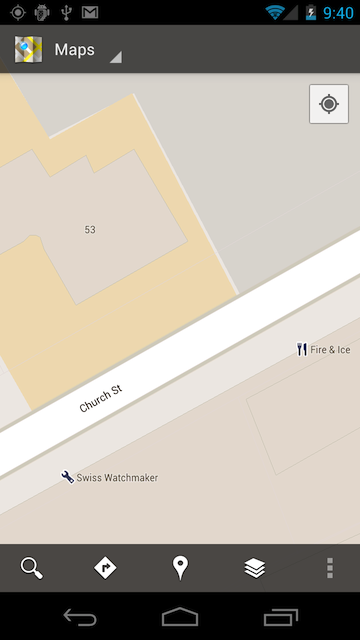

<a name="Recipe" class="injected"></a>


# Recipe

 [ ](Images/LaunchMap.png)

1.  Create a new Xamarin.Android application. The project template will create a single activity named Activity1 (MainActivity.cs), which contains a button.
2.  From the `button.Click` handler in MainActivity.cs, create a geo `Uri` with a latitude and longitude, passing the `Uri` to an intent.


```
intent.button.Click += delegate {
       var geoUri = Android.Net.Uri.Parse ("geo:42.374260,-71.120824");
       var mapIntent = new Intent (Intent.ActionView, geoUri);
       StartActivity (mapIntent);
};
```

Calling `StartActivity` and passing it the Intent in the above code launches
the maps app.

 <a name="Additional_Information" class="injected"></a>


# Additional Information

Each screen in an application is represented by an activity. Using
asynchronous messages called intents, when created from a Uri, causes the system
to load an activity that can handle the Uri scheme. In this recipe a Uri
beginning with geo: loads an activity from the maps application at the location
specified. See the [Geo Uri Scheme](/guides/android/platform_features/maps_and_location/part_1_-_maps_application#Geo_Uri_Scheme) section in the [Maps and Location](/guides/android/platform_features/maps_and_location)
article for the various formats supported by this scheme.

