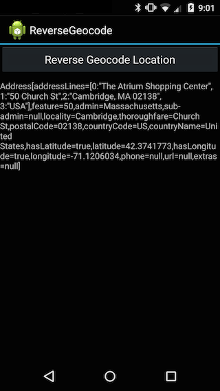

# Recipe

 [ ](Images/ReverseGeocode.png)

Follow these steps to reverse geocode a location.

1.  In  `Main.axml` (or whatever layout file you wish) add the following XML.


```
<?xml version="1.0" encoding="utf-8"?>
<LinearLayout xmlns:android="http://schemas.android.com/apk/res/android"
    android:orientation="vertical"
    android:layout_width="fill_parent"
    android:layout_height="fill_parent"
    >
<Button
    android:id="@+id/revGeocodeButton"
    android:layout_width="fill_parent"
    android:layout_height="wrap_content"
    android:text="@string/revGeocodeButtonText"
    />
 <TextView
    android:id="@+id/addressText"
    android:layout_width="fill_parent"
    android:layout_height="fill_parent"
   />
</LinearLayout>
```

<ol start="2">
  <li>Add a string resource named  <code>revGeocodeButtonText</code> to  Strings.Xml.</li>
</ol>

```
<string name="revGeocodeButtonText">Reverse Geocode Location</string>
```

<ol start="3">
  <li>Add a click event handler for the button in the Activity’s <code>OnCreate</code> method.</li>
</ol>

```
var button = FindViewById<Button> (Resource.Id.revGeocodeButton);
button.Click += async (sender, e) => { … }
```

Notice that this is using an `async` lambda to perform the work when the button is clicked. This will cause the work to performed asynchronously and not block the UI thread.

<ol start="4">
  <li>Next add the following code to the click event handler:</li>
</ol>

```
button.Click += async (sender, e) => {
	var geo = new Geocoder (this);
	var addresses = await geo.GetFromLocationAsync (42.37419, -71.120639, 1);

	var addressText = FindViewById<TextView> (Resource.Id.addressText);
	if (addresses.Any())
	{
		addresses.ToList().ForEach (addr => addressText.Append (addr + System.Environment.NewLine + System.Environment.NewLine));
	}
	else
	{
		addressText.Text= "Could not find any addresses.";
	}
};
```

Running the application results in the address being displayed as shown in the screenshot above.

 <a name="Additional_Information" class="injected"></a>


# Additional Information

This recipe creates a `Geocoder` instance, which is in the `Android.Locations`
namespace. The `Geocoder` calls `GetFromLocationAsync` with the latitude and longitude to reverse geocode. This will perform the network call asynchronously so that main UI thread is not blocked. When the result is returned, the method will return a list of addresses and continue on the UI thread.  In this call 1 address is returned because that is the number passed into the third
argument of the `GetFromLocationAsync` call. The returned address contains a variety of information about the location, including the street address.

