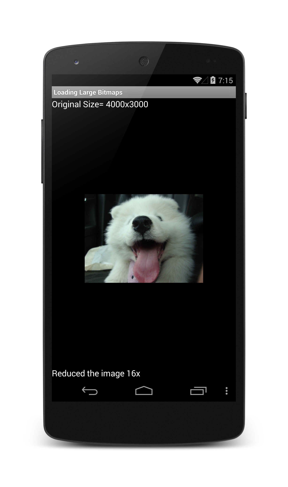

# Recipe

Images come in all shapes and sizes. In many cases they are larger than required for a typical application user interface (UI). For example, the system Gallery application displays photos taken using your Android device's camera which are typically much higher resolution than the screen density of your device.

Given that you are working with limited memory, ideally you only want to load a lower resolution version in memory. The lower resolution version should match the size of the UI component that displays it. An image with a higher resolution does not provide any visible benefit, but still takes up precious memory and incurs additional performance overhead due to additional scaling performed by the view.

In this recipe we will cover how to load a scaled down version of an image so that it can be efficiently displayed on an Android device with minimal memory impact. The following screenshot shows a 4000x3000 pixel drawable resource that has been scaled down appropriately:

## Read Bitmap Dimensions and Type

The [BitmapFactory](/api/type/Android.Graphics.BitmapFactory/) class provides several methods (such as [DecodeResourceAsync](/api/type/Android.Graphics.BitmapFactory/)) for creating a [Bitmap](/api/type/Android.Graphics.Bitmap/) from various sources. These methods attempt to allocate memory for the constructed bitmap and therefore can easily result in an [OutOfMemoryException](/api/type/System.OutOfMemoryException/). Each type of decode method has additional signatures that let you specify decoding options, such as loading a smaller version of the bitmap,  via the [BitmapFactory.Options](/api/type/Android.Graphics.BitmapFactory/%2bOptions) class.

Setting the [InJustDecodeBounds](/api/property/Android.Graphics.BitmapFactory+Options.InJustDecodeBounds/) property to `true` while decoding avoids memory allocation, returning `null` for the bitmap object but setting [OutWidth](/api/property/Android.Graphics.BitmapFactory+Options.OutWidth/), [ OutHeight](/api/property/Android.Graphics.BitmapFactory+Options.OutHeight/) and [ OutMimeType](/api/property/Android.Graphics.BitmapFactory+Options.OutMimeType/) . This technique allows you to read the dimensions and type of the image data prior to construction (and memory allocation) of the bitmap.

The following code snippet shows a function that will asynchronously retrieve the height and width of a drawable:

    async Task<BitmapFactory.Options> GetBitmapOptionsOfImageAsync()
    {
        BitmapFactory.Options options = new BitmapFactory.Options
                                        {
                                            InJustDecodeBounds = true
                                        };

        // The result will be null because InJustDecodeBounds == true.
        Bitmap result=  await BitmapFactory.DecodeResourceAsync(Resources, Resource.Drawable.samoyed, options);

        int imageHeight = options.OutHeight;
        int imageWidth = options.OutWidth;

        _originalDimensions.Text = string.Format("Original Size= {0}x{1}", imageWidth, imageHeight);

        return options;
    }

## Load a Scaled Down Version into Memory

Now that the image dimensions are known, they can be used to decide if the full image should be loaded into memory or if a sub-sampled version should be loaded instead. Here are some factors to consider:

* Estimated memory usage of loading the full image in memory.
* Amount of memory you are willing to commit to loading this image given any other memory requirements of your application.
* Dimensions of the target  [ ImageView](/api/type/Android.Widget.ImageView/)  or UI component that the image is to be loaded into.
* Screen size and density of the current device.

For example, consider an image that is 4000x3000 pixels with a bitmap configuration of [Argb8888](/api/property/Android.Graphics.Bitmap+Config.Argb8888/). It would require approximately 46.8MB of RAM to load the full image into memory. It is better to load a smaller version of the image. To tell the decoder to subsample the image and load a smaller version into memory, set [InSampleSize](/api/property/Android.Graphics.BitmapFactory+Options.InSampleSize/) to a value that will be used to scale down the image. For example, setting `InSampleSize` to 2 will cause **BitmapFactory** to scale the image down by a factor of 2. Any value can be used, however `BitmapFactory` is optimized to use a value that is factor of 2.

Here’s a method to calculate the `InSampleSize` value as a power of 2 based on a target width and height:

    public static int CalculateInSampleSize(BitmapFactory.Options options, int reqWidth, int reqHeight)
    {
        // Raw height and width of image
        float height = options.OutHeight;
        float width = options.OutWidth;
        double inSampleSize = 1D;

        if (height > reqHeight || width > reqWidth)
        {
            int halfHeight = (int)(height / 2);
            int halfWidth = (int)(width / 2);

            // Calculate a inSampleSize that is a power of 2 - the decoder will use a value that is a power of two anyway.
            while ((halfHeight / inSampleSize) > reqHeight && (halfWidth / inSampleSize) > reqWidth)
            {
                inSampleSize *= 2;
            }
        }

        return (int)inSampleSize;
    }

If we use this method with the 4000x3000 image above and want to scale it down to a 150x150 ImageView, this method will calculate an `InSampleSize` of 16. This means that BitmapFactory will load an 250x187 image requiring 183kB of RAM &#x2013; a significant savings.

## Load the Image

Let's see how to use this method to load a scaled down version of a bitmap. First we call `GetBitmapOptionsOfImageAsync` to obtain `BitmapFactory.Options` of the bitmap before loading it into memory. Then use the `Bitmap.Options` to help calculate the most efficient `InSampleSize` for a given image size. For example, the following snippet shows one example of how load a drawable resource and target a 150x150 thumbnail:

    protected async override void OnCreate(Bundle bundle)
    {
        base.OnCreate(bundle);
        SetContentView(Resource.Layout.Main);
        _imageView = FindViewById<ImageView>(Resource.Id.resized_imageview);

        BitmapFactory.Options options = await GetBitmapOptionsOfImageAsync();
        Bitmap bitmapToDisplay = await LoadScaledDownBitmapForDisplayAsync (Resources, options, 150, 150);
        _imageView.SetImageBitmap(bitmapToDisplay);
    }

Notice that all the work is performed asynchronously using `async`/`await`, this prevents the bitmap work from blocking the main thread and keeps the application responsive.

The function `LoadScaledDownBitmapForDisplayAsync` is displayed in the following snippet:

    public async Task<Bitmap> LoadScaledDownBitmapForDisplayAsync(Resources res, BitmapFactory.Options options, int reqWidth, int reqHeight)
    {
        // Calculate inSampleSize
        options.InSampleSize = CalculateInSampleSize(options, reqWidth, reqHeight);

        // Decode bitmap with inSampleSize set
        options.InJustDecodeBounds = false;

        return await BitmapFactory.DecodeResourceAsync(res, Resource.Drawable.samoyed, options);
    }

You can follow a similar process to decode bitmaps from other sources, such as a file on the SD Card, by substituting the appropriate [BitmapFactory.DecodeXXX](/api/type/Android.Graphics.BitmapFactory/%2fM) method as needed.

