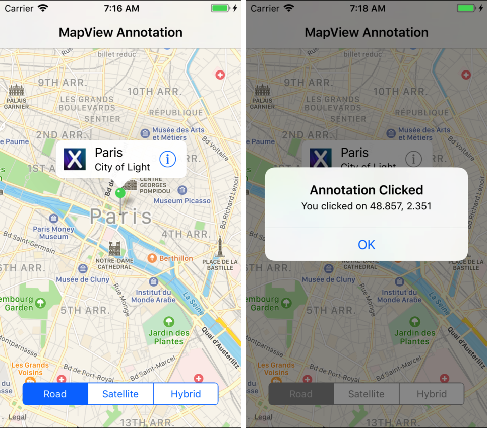

# Recipe

To add an annotation and respond to touching a button within the
annotation:

1.  Start with an existing `MKMapView` or review the
  [Displaying a Location](/Recipes/ios/content_controls/map_view/display_device_location) and
  [Add an Annotation](/Recipes/ios/content_controls/map_view/add_an_annotation_to_a_map) Recipes.

2.  Add an annotation as you normally would:

		var annotation = new BasicMapAnnotation
			(new CLLocationCoordinate2D (48.857, 2.351), "Paris", "City of Light");
		mapView.AddAnnotation (annotation);

3. Create a `MKMapViewDelegate` subclass (as shown).
  Notice how the `GetViewForAnnotation` method adds features such as the `LeftCalloutAccessoryView` and `RightCalloutAccessoryView`.

		protected class MapDelegate : MKMapViewDelegate
		{
			protected string annotationIdentifier = "BasicAnnotation";
			UIButton detailButton;
			MapViewController parent;
			public MapDelegate(MapViewController parent)
			{
				this.parent = parent;
			}
			/// 

			/// This is very much like the GetCell method on the table delegate
			/// 

			public override MKAnnotationView GetViewForAnnotation (MKMapView mapView, IMKAnnotation annotation)
			{
				// try and dequeue the annotation view
				MKAnnotationView annotationView = mapView.DequeueReusableAnnotation(annotationIdentifier);
				// if we couldn't dequeue one, create a new one
				if (annotationView == null)
					annotationView = new MKPinAnnotationView(annotation, annotationIdentifier);
				else // if we did dequeue one for reuse, assign the annotation to it
					annotationView.Annotation = annotation;
				// configure our annotation view properties
				annotationView.CanShowCallout = true;
				(annotationView as MKPinAnnotationView).AnimatesDrop = true;
				(annotationView as MKPinAnnotationView).PinColor = MKPinAnnotationColor.Green;
				annotationView.Selected = true;
				// you can add an accessory view, in this case, we'll add a button on the right, and an image on the left
				detailButton = UIButton.FromType(UIButtonType.DetailDisclosure);
				detailButton.TouchUpInside += (s, e) => {
					Console.WriteLine ("Clicked");
					//Create Alert
					var detailAlert = UIAlertController.Create ("Annotation Clicked", "You clicked on " +
						(annotation as MKAnnotation).Coordinate.Latitude.ToString() + ", " +
						(annotation as MKAnnotation).Coordinate.Longitude.ToString(), UIAlertControllerStyle.Alert);
					detailAlert.AddAction (UIAlertAction.Create ("OK", UIAlertActionStyle.Default, null));
					parent.PresentViewController (detailAlert, true, null);
				};
				annotationView.RightCalloutAccessoryView = detailButton;
				annotationView.LeftCalloutAccessoryView = new UIImageView(UIImage.FromBundle("29_icon.png"));
				return annotationView;
			}

			// as an optimization, you should override this method to add or remove annotations as the
			// map zooms in or out.
			public override void RegionChanged (MKMapView mapView, bool animated) {}
		}

4. Finally, assign the delegate (prior to the code added earlier to add the annotation to the MKMapView instance):

		// assign the delegate, which handles annotation layout and clicking
		// the Delegate needs to be assigned before adding the annotation
		mapView.Delegate = new MapDelegate(this);

		var annotation = new BasicMapAnnotation
			(new CLLocationCoordinate2D (48.857, 2.351), "Paris", "City of Light");
		mapView.AddAnnotation (annotation);

