<a name="Recipe" class="injected"></a>


# Recipe

An unwind Segue can be used to navigate back through a push or modal segue - for example by dismissing the modally presented view controller. In addition to this, you can unwind through not only one, but a series of push and modal segues and go back multiple steps in your navigation hierarchy with a single unwind action.

To create an unwind Segue in the Xamarin Designer for iOS:

-  Create a new  <span class="UIItem">iOS > Single View Application</span> with Visual Studio for Mac or Visual Studio:


 [ 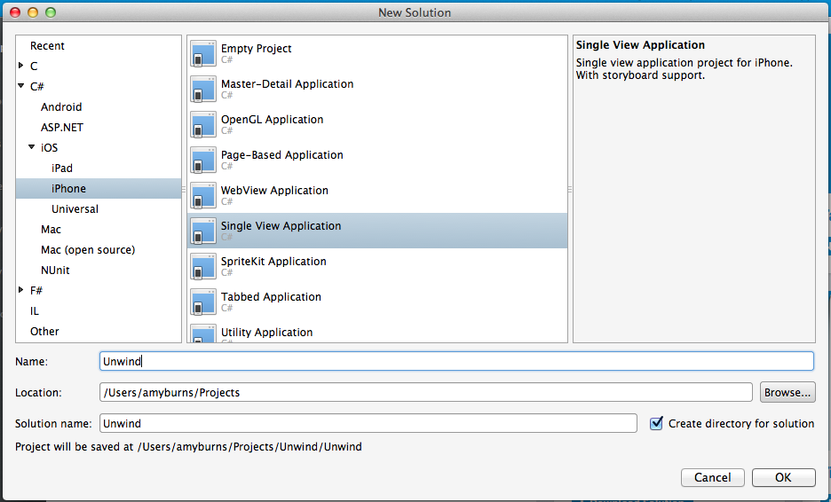](Images/unwindSegue2.png)

-  Double-click on the  `.storyboard` file to open it in the iOS Designer and view the default user interface consisting of a single UIViewController and UIView.


 [ 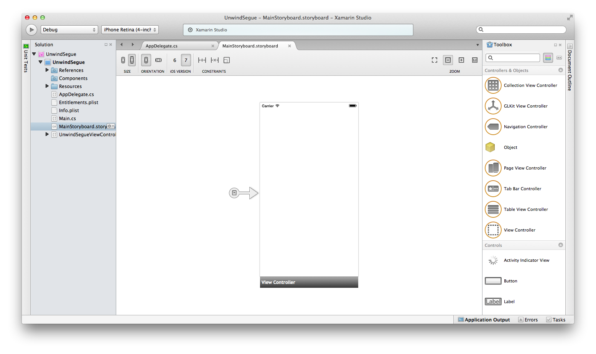](Images/newStoryboard.png)

-  Drag a new Navigation Controller onto the design surface.&nbsp;


 [ 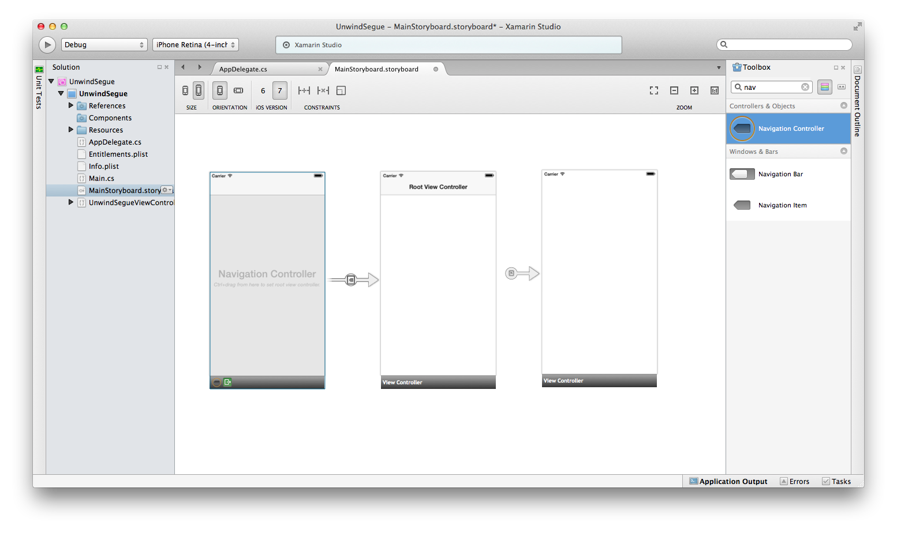](Images/AddNavController.png)

-  Drag a new UIViewController onto the design surface


 [ 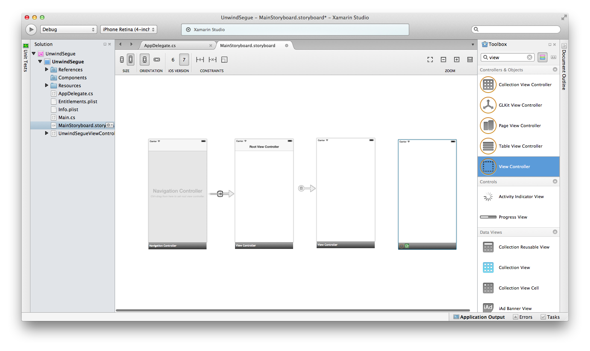](Images/AddVC.png)

-  Select each UIView and change the background colour using the  <span class="UIItem">Properties Pad</span> , as shown in the screenshot below.


 [ 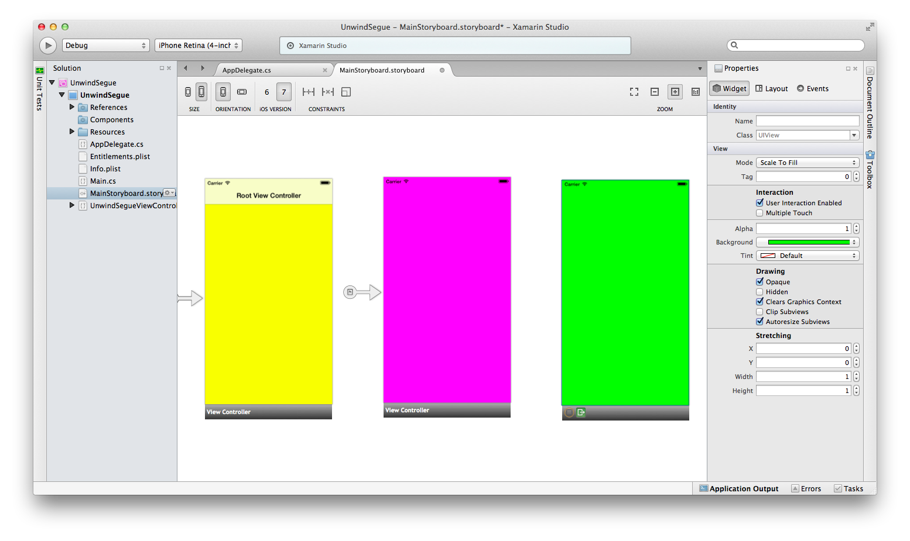](Images/BackgroundColour.png)

-  Select each UIViewController and change the  <span class="UIItem">Identity > Class</span> in the  <span class="UIItem">Properties Pad</span> to reflect the background color. -   Yellow Background: YellowViewController
-   Magenta Background: PinkViewController
-   Green Background: GreenViewController


 [ 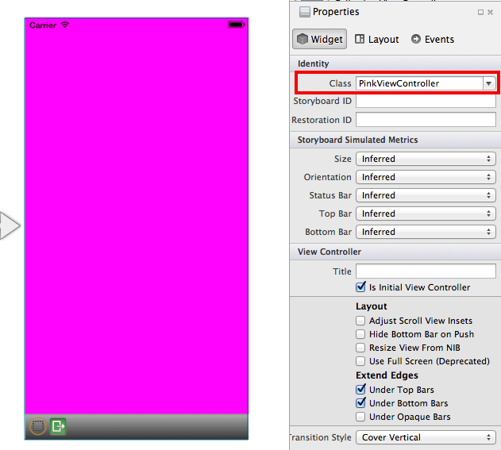](Images/NameViewControllers.png)

-  To finish creating the UI use the  <span class="UIItem">Toolbox</span> and add  <span class="UIItem">Buttons</span> to your View as follows. -   YellowViewController : 1  <span class="UIItem">Button</span>  with title "Go To Pink"
-   PinkViewController: 2  <span class="UIItem">Buttons</span>  , one with title "Go To Green", the other "Unwind to Yellow"
-   GreenViewController: 2  <span class="UIItem">Buttons</span>  , one with title "Unwind to Pink", the other "Unwind to Yellow"


 [ 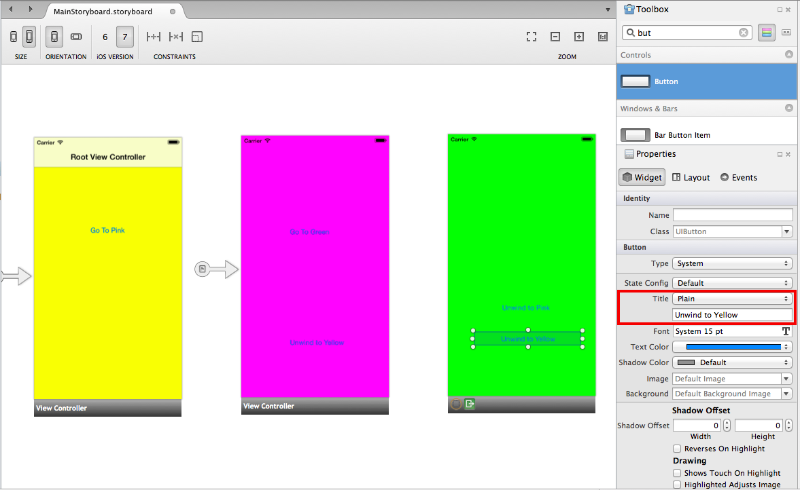](Images/AddButtons.png)

-  The Storyboard should now look like this:


 [ 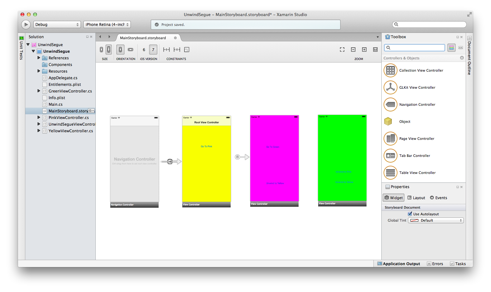](Images/finishedui.png)

-  Now, let's set the navigation between each Scene. First move the sourceless Segue to just before the Navigation Controller. This will tell the application which screen the user is expected to see first.


 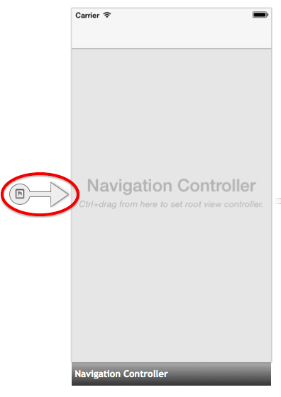

-  By default there should be a Segue between the Navigation Controller and the View Controller. If there is not, add one with the relationship 'Root'.


 [ 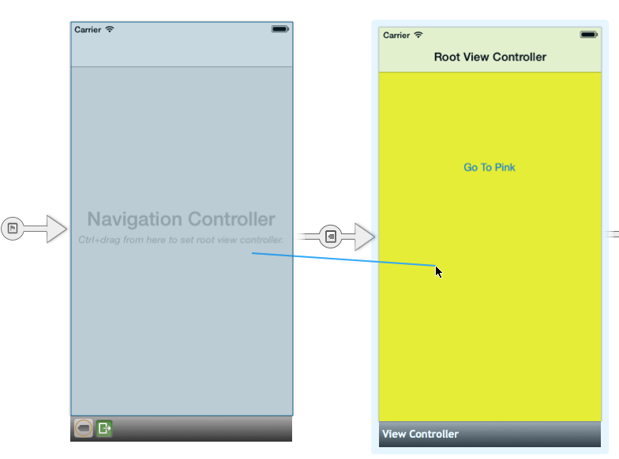](Images/creatingSegue.png)

 [ 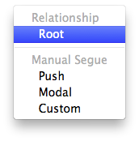](Images/creatingRelationship.png)

-  Next, add Modal Segues between each Scene. To do this hold down the Control key and click then drag from the 'Go To Pink' Button to the PinkViewController. On ‘mouse up’ the following options appear – choose Modal.


 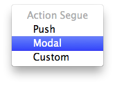

-  Repeat the previous step, this time between the 'Go To Green' and the GreenViewController.


-  We now need to specify an  *Action* method in the View Controllers we wish to unwind to. The method takes a  `segue` paramater and can be called anything you wish. Make sure the Action String and method name match. Add the following code to YellowViewController:


```
[Action ("UnwindToYellowViewController:")]
public void UnwindToYellowViewController (UIStoryboardSegue segue)
{
    Console.WriteLine ("We've unwinded to Yellow!");
}
```

-  Add a similar method to the PinkViewController:


```
[Action ("UnwindToPinkViewController:")]
public void UnwindToPinkViewController (UIStoryboardSegue segue)
{
    Console.WriteLine ("We've unwinded to Pink!");
}
```

-  <span class="UIItem">Save All</span> and return to the MainStoryboard.storyboard, where the unwind segue will be added.


-  Create another Segue, this time from the 'Unwind to Yellow' Button in the PinkViewController to the Scene Exit


 [ ](Images/SceneExit.png)

 [ 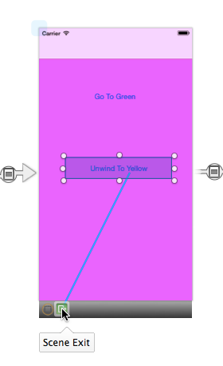](Images/SceneExitBig.png)

-  On mouse-up the following menu will appear, reflecting the Actions added in the PinkViewController.cs and YellowViewcontroller.cs previously. Select the 'UnwindToYellowViewController' for this Button.


 [ 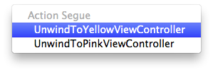](Images/ActionSegue.png)

-  Move to the GreenViewController and repeat the steps above to add an unwind Segue to both buttons. The 'Unwind To Yellow' Button should map to  `UnwindToYellowViewController` , and the 'Unwind To Pink' Button should map to  `UnwindToPinkViewController` .


The application should now navigate as illustrated in the screenshot below:

 [ 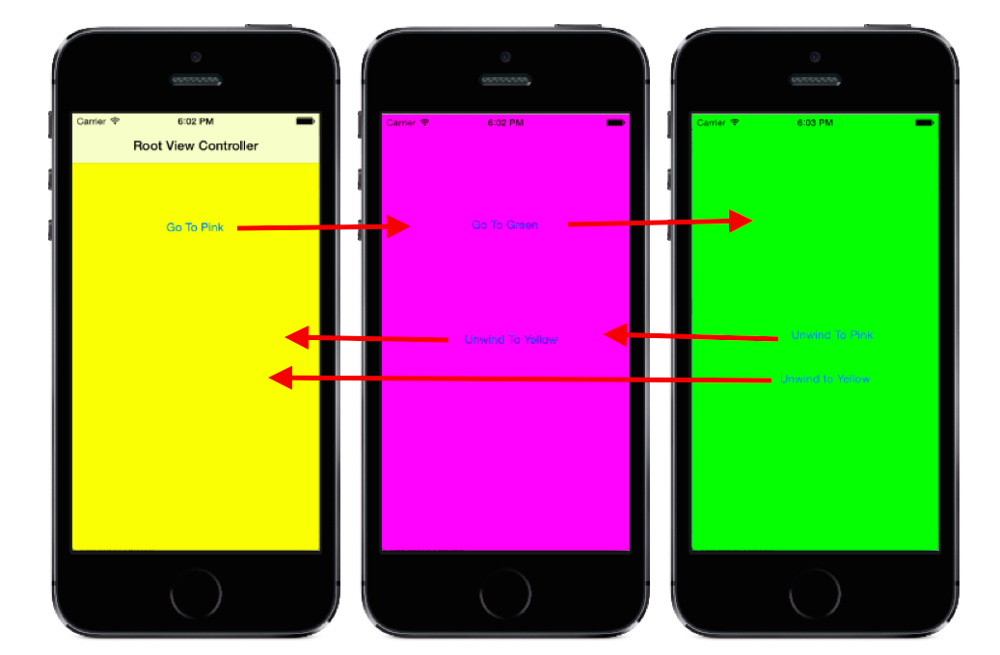](Images/unwind.png)

 [ ](Images/ApplicationOutput.png)

