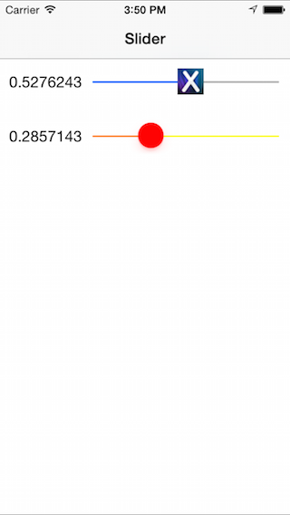

<a name="Recipe" class="injected"></a>


# Recipe

A slider control can be customized by changing the image used for the
drag-able portion, or by changing the colors of the control, like this:

 

See the [Specify Slider Value](/Recipes/ios/standard_controls/sliders/specify_slider_value) recipe for instructions on creating slider controls. To change the
appearance of a slider:

1. To set the slider’s “thumb” to an image:

```
sliderImage.SetThumbImage(UIImage.FromFile("29_icon.png"), UIControlState.Normal);
```

<ol start="2"><li>Or to set the colors of each different element of a slider:</li></ol>

```
sliderColor.ThumbTintColor = UIColor.Red;
sliderColor.MinimumTrackTintColor = UIColor.Orange;
sliderColor.MaximumTrackTintColor = UIColor.Yellow;
```

