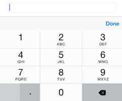
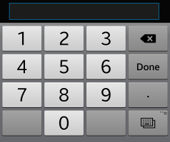
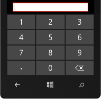

# Overview

To dismiss a keyboard in Xamarin.Forms the user can normally just tap outside the input control, however this is unintuitive and may be difficult when using a `ListView` or `TableView` to host the input. A [custom-renderer](http://docs.xamarin.com/guides/xamarin-forms/custom-renderer) can be written for iOS that adds a toolbar and **Done** button to programmatically dismiss the keyboard.

Any iOS keyboard type can have a toolbar added; this example shows the numeric keypad.

## Common Xamarin.Forms code

Create a subclass of `Entry` - in this case we do not need to implement any additional properties or methods on the class. Adding this subclass in the common code does not affect the rendering in any way (until a custom renderer is added).

```
/// <summary>
/// Required for Custom Renderer to target just this Type
/// </summary>
public class DoneEntry : Entry
{
}
```

In the code building the user interface for a page, create an instance of the subclass:

```
var numberEntry = new DoneEntry ();
numberEntry.Keyboard = Keyboard.Numeric; // optional, but this approach is especially useful for Numeric keyboard
```

If the user interface is defined in XAML then a custom `xmlns` must be declared that references the common code assembly, and then the custom prefix used when declaring the new control:

```
<ContentPage xmlns="http://xamarin.com/schemas/2014/forms"
             xmlns:x="http://schemas.microsoft.com/winfx/2009/xaml"
             xmlns:local="clr-namespace:YOUR_APP_NAMESPACE;assembly=YOUR_APP_ASSEMBLY"
             x:Class="YOUR_APP_NAMESPACE.SomeItemPage">
    <local:DoneEntry x:Name="numberEntry" />
</ContentPage>
```


## iOS application project

In the iOS project implement a custom renderer as shown (remember to update the namespace to reflect your project):

```
using System;
using Xamarin.Forms.Platform.iOS;
using Xamarin.Forms;
using UIKit;
using CoreGraphics;
using YOUR_APP_NAMESPACE.iOS;
using YOUR_APP_NAMESPACE;

[assembly: ExportRenderer(typeof(DoneEntry), typeof(DoneEntryRenderer))]
namespace YOUR_APP_NAMESPACE.iOS
{
	public class DoneEntryRenderer : EntryRenderer
	{
		protected override void OnElementChanged(ElementChangedEventArgs<Entry> e)
		{
			base.OnElementChanged(e);

			var toolbar = new UIToolbar(new CGRect(0.0f, 0.0f, Control.Frame.Size.Width, 44.0f));

			toolbar.Items = new[]
			{
				new UIBarButtonItem(UIBarButtonSystemItem.FlexibleSpace),
				new UIBarButtonItem(UIBarButtonSystemItem.Done, delegate { Control.ResignFirstResponder(); })
			};

			this.Control.InputAccessoryView = toolbar;
		}
	}
}

```

A `Numeric` iOS entry is shown below with the **Done** button visible above the keypad:



If you are using an `EntryCell` in a list or table, refer to [this version on the forums](https://forums.xamarin.com/discussion/comment/83751/#Comment_83751).


## Android and Windows Phone platforms

These platforms offer built-in support for dismissing the keyboard, no additional code is required. Android's keyboard already contains a **Done** button, and Windows Phone uses the hardware **back** button as a way to hide whatever keyboard is showing.

The Android and Windows Phone keypads are shown here for comparison:


 


# Summary

This recipe shows how to add a toolbar as an `InputAccessoryView` on iOS so that you can dismiss the keyboard via a **Done** button in Xamarin.Forms.

## Credits

This approach has been documented a couple of times in the [forums](https://forums.xamarin.com/). The code from [this thread](https://forums.xamarin.com/discussion/26532/dismiss-numeric-keyboard#latest) was incorporated into this recipe - thanks to [Paul Diston](https://forums.xamarin.com/profile/56293/PaulDiston) and [Max Pool](https://forums.xamarin.com/profile/69617/MaxPool) for their contribution. It is also mentioned [here](http://forums.xamarin.com/discussion/18346/add-done-button-to-keyboard-on-ios) by [Rogier van der Hee](http://forums.xamarin.com/profile/311/rogihee), [Pedro Lima](http://forums.xamarin.com/profile/45170/PedroLima), and [Pavel Penkava](http://forums.xamarin.com/profile/28744/PavelPenkava.8634).
Also see [adding custom buttons to iOS...](http://nnish.com/2013/12/02/adding-custom-buttons-to-ios-keyboard-in-c-xamarin/) for more info.

