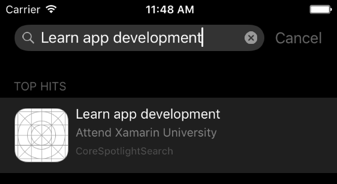

# Overview

Core Spotlight is a framework introduced in iOS 9 that provides a database-like API to add, edit, or delete links to content within an app. Items that have been added using Core Spotlight will then be available in Spotlight search on the device. The framework is typically used to provide searchability for private data stored on a device. For more information, see [Search with Core Spotlight](http://developer.xamarin.com/guides/ios/platform_features/introduction_to_ios9/search/corespotlight/).

The sample app demonstrates a Todo list application where the data is stored in an in-memory collection. When the sample app starts it indexes the `TodoItem` data in the app. The search index is then updated as `TodoItem` instances are added and deleted in the app. Spotlight search can then be used to locate indexed data from the app, as shown in the following screenshot:



When the user taps on a search result item for the app that was added via Core Spotlight, the app is launched and the user is shown the `TodoItem` data on the `TodoItemPage`.

The indexing functionality is contained in the `SpotlightSearch` class in the iOS project, and is invoked via the Xamarin.Forms [`DependencyService`](/api/type/Xamarin.Forms.DependencyService/) from the Portable Class Library (PCL) project. For more information about the `DependencyService` class, see [Accessing Native Features with DependencyService](https://developer.xamarin.com/guides/xamarin-forms/dependency-service/).

## Indexing Items

The following code example shows how app content is indexed for Spotlight search:

```
void ReIndexSearchItems (List<TodoItem> items)
{
  var searchableItems = new List<CSSearchableItem> ();
  foreach (var item in todoItems) {
    // Create attributes to describe item
    var attributes = new CSSearchableItemAttributeSet (UTType.Text);
    attributes.Title = item.Name;
    attributes.ContentDescription = item.Notes;

    // Create item
    var searchableItem = new CSSearchableItem (item.ID, "com.companyname.corespotlightsearch", attributes);
    searchableItems.Add (searchableItem);
  }

  // Index items
  CSSearchableIndex.DefaultSearchableIndex.Index (searchableItems.ToArray<CSSearchableItem> (), error => {
    if (error != null) {
      Debug.WriteLine (error);
    } else {
      Debug.WriteLine ("Successfully indexed items");
    }
  });
}
```

A [`CSSearchableItem`](/api/type/CoreSpotlight.CSSearchableItem/) instance is created for each `TodoItem` instance, with the `TodoItem.ID` property value being used as the identifier of the `CSSearchableItem`. Each `CSSearchableItem` includes a [`CSSearchableItemAttributeSet`](/api/type/CoreSpotlight.CSSearchableItemAttributeSet/) instance that contains the data that describes the `TodoItem`. The [`CSSearchableIndex.DefaultSearchableIndex.Index `](/api/member/CoreSpotlight.CSSearchableIndex.Index/p/CoreSpotlight.CSSearchableItem[]/System.Action{Foundation.NSError}/) method is then used to index the searchable items, with a completion handler running when finished.

## Creating and Updating an item

The following code example show how to create a single searchable item and index it using Core Spotlight:

```
public void CreateSearchItem (TodoItem item)
{
  // Create attributes to describe item
  var attributes = new CSSearchableItemAttributeSet (UTType.Text);
  attributes.Title = item.Name;
  attributes.ContentDescription = item.Notes;

  // Create item
  var searchableItem = new CSSearchableItem (item.ID, "com.companyname.corespotlightsearch", attributes);

  // Index item
  CSSearchableIndex.DefaultSearchableIndex.Index (new CSSearchableItem[]{ searchableItem }, error => {
    if (error != null) {
      Debug.WriteLine (error);
    } else {
      Debug.WriteLine ("Successfully indexed item");
    }
  });
}
```

A new [`CSSearchableItem`](/api/type/CoreSpotlight.CSSearchableItem/) is created for the `TodoItem`, with the `TodoItem.ID` property value being used as the identifier of the `CSSearchableItem`. The `CSSearchableItem` includes a [`CSSearchableItemAttributeSet`](/api/type/CoreSpotlight.CSSearchableItemAttributeSet/) instance that contains the data that describes the `TodoItem`. The [`CSSearchableIndex.DefaultSearchableIndex.Index `](/api/member/CoreSpotlight.CSSearchableIndex.Index/p/CoreSpotlight.CSSearchableItem[]/System.Action{Foundation.NSError}/) method is then used to index the searchable item, with a completion handler running when finished.

The `CreateSearchItem` method can also be used to update an existing searchable item, by creating a new [`CSSearchableItem`](/api/type/CoreSpotlight.CSSearchableItem/) using the same identifier that was used to create the original item. The item will then be updated with the data contained in the [`CSSearchableItemAttributeSet`](/api/type/CoreSpotlight.CSSearchableItemAttributeSet/) instance.

## Restoring an Item

When the user taps on an item added to the search result via Core Spotlight for the app, the [`AppDelegate.ContinueUserActivity`](/api/member/UIKit.UIApplicationDelegate.ContinueUserActivity/) method is called, as shown in the following code example:

```
public override bool ContinueUserActivity (UIApplication application, NSUserActivity userActivity, UIApplicationRestorationHandler completionHandler)
{
  if (userActivity.ActivityType == CSSearchableItem.ActionType) {
    string id = userActivity.UserInfo.ObjectForKey (CSSearchableItem.ActivityIdentifier).ToString ();
    if (!string.IsNullOrEmpty (id)) {
      MessagingCenter.Send<CoreSpotlightSearch.App, string> (Xamarin.Forms.Application.Current as CoreSpotlightSearch.App, "ShowItem", id);
    }
  }
  return true;
}
```

Provided that the activity has an [`ActivityType`](/api/property/Foundation.NSUserActivity.ActivityType/) of [`CSSearchableItem.ActionType`](/api/property/CoreSpotlight.CSSearchableItem.ActionType/), the identifier of the activity is restored. This identifier is the `TodoItem.ID` property value that was previously stored as the identifier of a [`CSSearchableItem`](/api/type/CoreSpotlight.CSSearchableItem/) instance, prior to indexing. The identifier is then sent as a `ShowItem` message using the Xamarin.Forms [`MessagingCenter`](/api/type/Xamarin.Forms.MessagingCenter/). In response, the registered callback for the `ShowItem` message is executed, as shown in the following code example:

```
public App ()
{
  ...
  MessagingCenter.Subscribe <CoreSpotlightSearch.App, string> (this, "ShowItem", async (sender, arg) => {
    var todoItems = TodoManager.All;
    var item = todoItems.FirstOrDefault (i => i.ID == arg);

    await MainPage.Navigation.PopToRootAsync ();
    var todoItemPage = new TodoItemPage ();
    todoItemPage.BindingContext = item;
    await MainPage.Navigation.PushAsync (todoItemPage);
  });
}
```

When the callback for the `ShowItem` message is executed, the `TodoItem` for the identifier is retrieved. The `TodoItemPage` is then navigated to, where the `TodoItem` instance is displayed through data binding.

For more information about using the [`MessagingCenter`](/api/type/Xamarin.Forms.MessagingCenter/) class, see [Publish and Subscribe with MessagingCenter](https://developer.xamarin.com/guides/xamarin-forms/messaging-center/).

## Deleting an Item

The following code example shows how to delete an indexed item by its identifier:

```
public void DeleteSearchItem (TodoItem item)
{
  CSSearchableIndex.DefaultSearchableIndex.Delete (new string[]{ item.ID }, error => {
    if (error != null) {
      Debug.WriteLine (error);
    } else {
      Debug.WriteLine ("Successfully deleted item");
    }
  });
}
```

Core Spotlight provides multiple approaches to deleting an indexed item when it's no longer required. For more information see [Deleting an Item](https://developer.xamarin.com/guides/ios/platform_features/introduction_to_ios9/search/corespotlight/#Deleting_an_Item).

# Summary

This recipe showed how to use the iOS9 Core Spotlight framework to make Xamarin.Forms app content searchable through Spotlight search.

