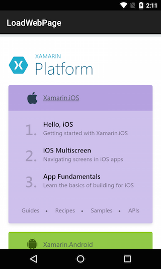

# Recipe

-  Create a layout file that contains a `WebView`, such as **Main.axml** in the example code:


```
<?xml version="1.0" encoding="utf-8"?>
<WebView xmlns:android="http://schemas.android.com/apk/res/android"
  android:layout_width="fill_parent"
  android:layout_height="fill_parent"
  android:id="@+id/LocalWebView">
</WebView>
```

-  Use the Main.axml as the view for your activity and assign the WebView to a local variable.


```
SetContentView (Resource.Layout.Main);

WebView localWebView = FindViewById<WebView>(Resource.Id.LocalWebView);
webView.SetWebViewClient (new WebViewClient ()); // stops request going to Web Browser
```

-  Use the LoadUrl method with web address you wish to display (eg. "[http://developer.xamarin.com](http://developer.xamarin.com)") to show that page to the user:


```
localWebView.LoadUrl("http://developer.xamarin.com");
```



If the website you are navigating to requires Javascript,
  enable it via the `Settings.JavaScriptEnabled` property:

```
webView.Settings.JavaScriptEnabled = true;
webView.LoadUrl("http://youtube.com");
```

