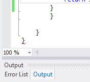
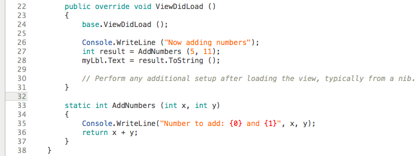
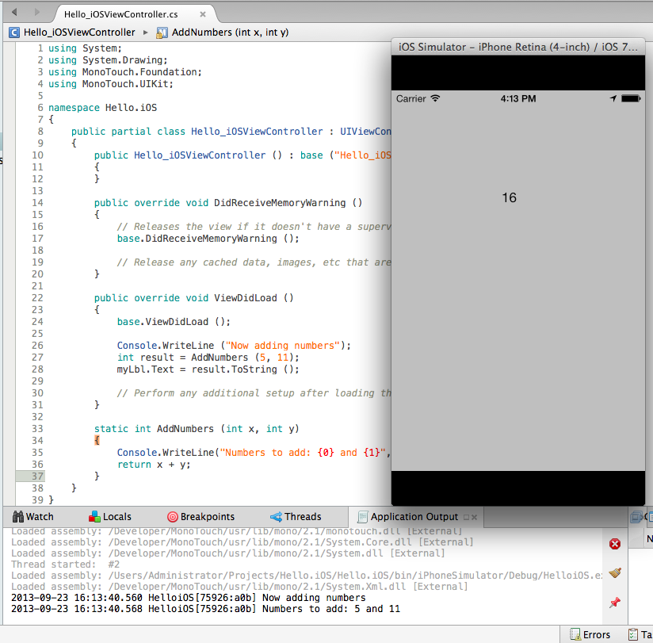
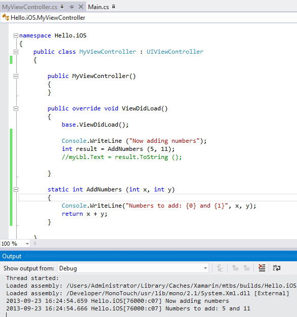

# Recipe

The log window is a useful debugging tool, and is simple to use.

1. First, locate the log window. You can toggle it in Visual Studio for Mac by selecting
the Application Output panel on the bottom right:

 

In Visual Studio, select the Output panel on the bottom left:

 

<ol start="2">
  <li>Choose a point in your code where you would like to output information to the log window:</li>
</ol>

 

<ol start="3">
  <li>Get the console to give you some helpful feedback about what is going on in your code. For example, you can have it output a message when a particular event occurs:</li>
</ol>

 

 

