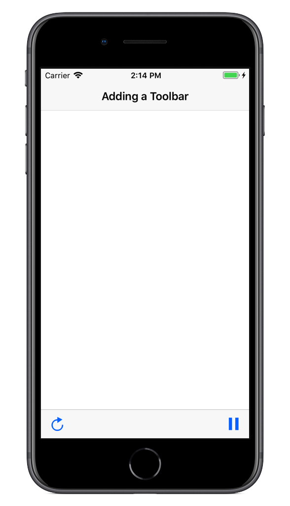

<a name="Recipe" class="injected"></a>


# Recipe

To add a toolbar to the bottom of the view:

<ol><li>Create a toolbar by setting an array of UIBarButtonItems:</li></ol>


```
this.SetToolbarItems( new UIBarButtonItem[] {
    new UIBarButtonItem(UIBarButtonSystemItem.Refresh, (s,e) => {
        Console.WriteLine("Refresh clicked");
    })
    , new UIBarButtonItem(UIBarButtonSystemItem.FlexibleSpace) { Width = 50 }
    , new UIBarButtonItem(UIBarButtonSystemItem.Pause, (s,e) => {
        Console.WriteLine ("Pause clicked");
    })
}, false);
```

<ol start="2"><li>Finally, to show the Toolbar: </li></ol>


```
this.NavigationController.ToolbarHidden = false;
```


 <a name="Additional_Information" class="injected"></a>


# Additional Information

If you are creating a complex toolbar with many items, it might be easier to
construct the buttons separately:

```
var refreshButton = new UIBarButtonItem(UIBarButtonSystemItem.Refresh, (s, e) => {
    Console.WriteLine("Refresh clicked");
})

var pauseButton = new UIBarButtonItem(UIBarButtonSystemItem.Pause, (s, e) => {
    Console.WriteLine("Pause clicked");
})

var spacer = new UIBarButtonItem(UIBarButtonSystemItem.FlexibleSpace) { Width = 50 };

this.SetToolbarItems( new UIBarButtonItem[] {
    refreshButton, spacer, pauseButton
}, false);
```

