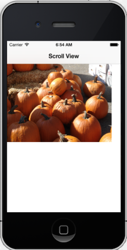

<a name="Recipe" class="injected"></a>


# Recipe

To display an image inside a scroll view and support the pinch-to-zoom
gesture:

1. Add the image to your Xamarin.iOS project and ensure the <span class="s2"><strong>Build Action</strong></span> is set to <span class="s2"><strong>BundleResource</strong></span>. The example code loads the image
“halloween.jpg”

2. Declare class level fields for a `UIScrollView` and `UIImageVIew`

```
UIScrollView scrollView;
UIImageView imageView;
```

<ol start="3">
  <li>Create a <code>UIScrollView</code> and it to the View Controller:</li>
</ol>

```
scrollView = new UIScrollView (
    new CGRect (0, 0, View.Frame.Width
    , View.Frame.Height - NavigationController.NavigationBar.Frame.Height));/
View.AddSubview (scrollView);
```

<ol start="4">
  <li>Create a <code>UIImageView</code> and it to the Scroll View:</li>
</ol>

```
imageView = new UIImageView (UIImage.FromFile ("halloween.jpg"));
scrollView.ContentSize = imageView.Image.Size;
scrollView.AddSubview (imageView);
```

<ol start="5">
  <li>Set the zoom properties:</li>
</ol>

```
scrollView.MaximumZoomScale = 3f;
scrollView.MinimumZoomScale = .1f;
scrollView.ViewForZoomingInScrollView += (UIScrollView sv) => { return imageView; };
```

Only a portion of the image will appear on the iPhone screen. The user can
pan around the image by dragging or zoom with the pinch gesture.

To test the pinch gesture in the simulator, hold down the <span class="s2"><strong>option</strong></span> key while dragging – two grey circles will
be displayed to illustrate the simulated pinch gesture:

 [ ](Images/scrollviewzoom.png)

