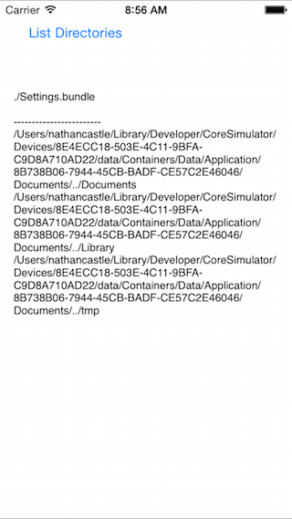

<a name="Recipe" class="injected"></a>


# Recipe

You can list the directories in a Xamarin.iOS application in the following ways:

-  To list the directories in the application bundle, call `EnumerateDirectories` with the current path syntax:


```
var directories = System.IO.Directory.EnumerateDirectories("./");
```

-  To list the directories in the application’s home directory, construct the path like this:


```
var path = Environment.GetFolderPath (Environment.SpecialFolder.MyDocuments);
directories = System.IO.Directory.EnumerateDirectories(path+"/..");
```

-  The directory list is returned as `IEnumerable&lt;string&gt;` which can be output to the *Console* or a `UITextView`:


```
foreach (var directory in directories) {
    Console.WriteLine(directory);
    txtView.Text += directory + Environment.NewLine;
}
```

The sample application output displays all the output from step 1 and step
2:

 [ ](Images/EnumerateDirectories.png)

 <a name="Additional_Information" class="injected"></a>


### Additional Information

Remember that the iOS file system is case-sensitive (although the simulator
is not). Ensure that you type file and directory names correctly.

