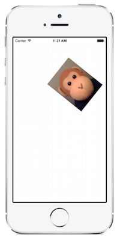

# Recipe

 [ ](Images/DragRotateImage.png)

The following code assigns a `UIRotationGestureRecognizer` and a `UIPanGestureRecognizer` to a `UIImageView`, with implementations that enable image dragging and rotation via touch:

```
UIRotationGestureRecognizer rotateGesture;
UIPanGestureRecognizer panGesture;
UIImageView imageView;

public override void ViewDidLoad ()
{
  base.ViewDidLoad ();

  nfloat r = 0;
  nfloat dx = 0;
  nfloat dy = 0;

  using (var image = UIImage.FromFile ("monkey.png")) {
    imageView = new UIImageView (image){Frame = new CoreGraphics.CGRect (new PointF(0,0), image.Size)};
    imageView.UserInteractionEnabled = true;
    View.AddSubview (imageView);
  }

  rotateGesture = new UIRotationGestureRecognizer (() => {
    if ((rotateGesture.State == UIGestureRecognizerState.Began || rotateGesture.State == UIGestureRecognizerState.Changed) && (rotateGesture.NumberOfTouches == 2)) {

      imageView.Transform = CGAffineTransform.MakeRotation (rotateGesture.Rotation + r);
    } else if (rotateGesture.State == UIGestureRecognizerState.Ended) {
      r += rotateGesture.Rotation;
    }
  });

  panGesture = new UIPanGestureRecognizer (() => {
    if ((panGesture.State == UIGestureRecognizerState.Began || panGesture.State == UIGestureRecognizerState.Changed) && (panGesture.NumberOfTouches == 1)) {

      var p0 = panGesture.LocationInView (View);

      if (dx == 0)
        dx = p0.X - imageView.Center.X;

      if (dy == 0)
        dy = p0.Y - imageView.Center.Y;

      var p1 = new CGPoint (p0.X - dx, p0.Y - dy);

      imageView.Center = p1;
    } else if (panGesture.State == UIGestureRecognizerState.Ended) {
      dx = 0;
      dy = 0;
    }
  });

  imageView.AddGestureRecognizer (panGesture);
  imageView.AddGestureRecognizer (rotateGesture);

  View.BackgroundColor = UIColor.White;
}
```

When the user touches the image with a single touch, the code in the `UIPanGestureRecognizer` moves the image to track the touch point as it changes. Likewise, when the user touches the image with two fingers and rotates, the image rotates as well thanks to the code in the `UIRotationGestureRecognizer`.


# Additional Information

Gesture recognizers allow touch support to be encapsulated in reusable classes that can be applied to any `UIView`, such as the `UIImageView` shown in this recipe. There are several different types of gesture recognizers provided by iOS. Additionally, iOS allows custom recognizers to be defined.

