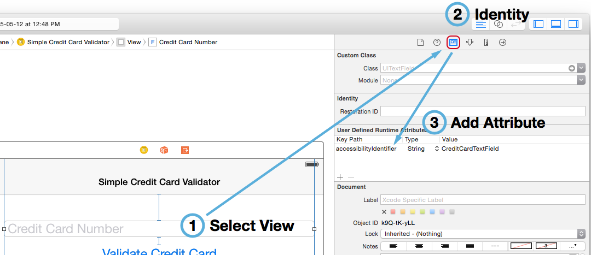

# Overview

One powerful way to reference controls in Calabash and Xamarin.UITests is to use the *marked parameter* or the [`AppQuery.Marked`](/api/member/Xamarin.UITest.Queries.AppQuery.Marked/) method. This method will locate views on the screen using the *accessibility identifier* or the [*accessibility label*](/api/property/UIKit.UIView.AccessibilityLabel/) of the UIView. The accessibility identifier should be a string that is unique to each view on a given screen. This will make it much easier locate and interact with views during an automated test.

This recipe will discuss how to set in an iOS application and provide an example of how to use it in both Calabash and UITest.

# Setting the Accessibility Identifier

There are two ways to set the accessibility identifier in iOS:

* **Programmatically** &ndash; The accessibility identifier can be set in code.
* **Using Interface Builder** &ndash; It is possible to set user attributes like the accessibility identifier can be added to a view using the XCode Inteface builder.

## Setting the Accessibility ID Programatically

The `AccessibilityIdentifier` is bound by modern versions of Xamarin.iOS. In your C# code you may set the value like so:

    view.AccessibilityIdentifier = "CreditCardTextField";

The `ViewDidLoad` event is a logical place to set the `AccessibilityIdentifier` property.

## Using the Xcode Interface Builder

It is possible to set the `accessibilityIdentifier` using the Xcode Interface Builder. To do so, open up the storyboard (or XIB) in Xcode, and follow these steps:
 
1. Select the view.
2. In the **Inspector Pane**, select the **Identity tab**.
3. Add a new **User Defined Runtime Attribute** named `accessibilityIdentifer` of type `String`. Set the value to what ever you would like the accessibility identifier to be.

# Using the Accessibility Identifier

As described above, the accessibility identifier is a useful property for uniquely identifying views.  

## Using the Accessibility Identifier in UITest

The following snippet shows how to query for the `UITextView` that was added by the code above using the Xamarin.UITest REPL:

    >>> app.Query(c=>c.Marked("CreditCardTextField"))
    Query for Marked("CreditCardTextField") gave 1 results.
    [
      {
        "Id": "CreditCardTextField",
        "Description": "<UITextView: 0x7d2e5c00; frame = (10 120; 300 40); text = ''; clipsToBounds = YES; gestureRecognizers = <NSArray: 0x7c0807b0>; layer = <CALayer: 0x7c080100>; contentOffset: {0, -64}>",
        "Rect": {
          "Width": 300.0,
          "Height": 40.0,
          "X": 10.0,
          "Y": 120.0,
          "CenterX": 160.0,
          "CenterY": 140.0
        },
        "Label": null,
        "Text": "",
        "Class": "UITextView",
        "Enabled": false
      }
    ]
    >>>

## Using the Accessibility Identifier in Calabash

The following snippet shows how to query for a `UITextView` using Calabash:

    irb(main):012:0> query "UITextView marked:'CreditCardTextField'"
    [
        [0] {
                   "text" => "",
                   "rect" => {
                "center_x" => 160,
                       "y" => 120,
                   "width" => 300,
                       "x" => 10,
                "center_y" => 140,
                  "height" => 40
            },
            "description" => "<UITextView: 0x7d25c600; frame = (10 120; 300 40); text = ''; clipsToBounds = YES; gestureRecognizers = <NSArray: 0x7c01bad0>; layer = <CALayer: 0x7c00ac40>; contentOffset: {0, -64}>",
                     "id" => "CreditCardTextField",
                  "label" => nil,
                  "class" => "UITextView",
                  "frame" => {
                     "y" => 120,
                 "width" => 300,
                     "x" => 10,
                "height" => 40
            }
        }
    ]

